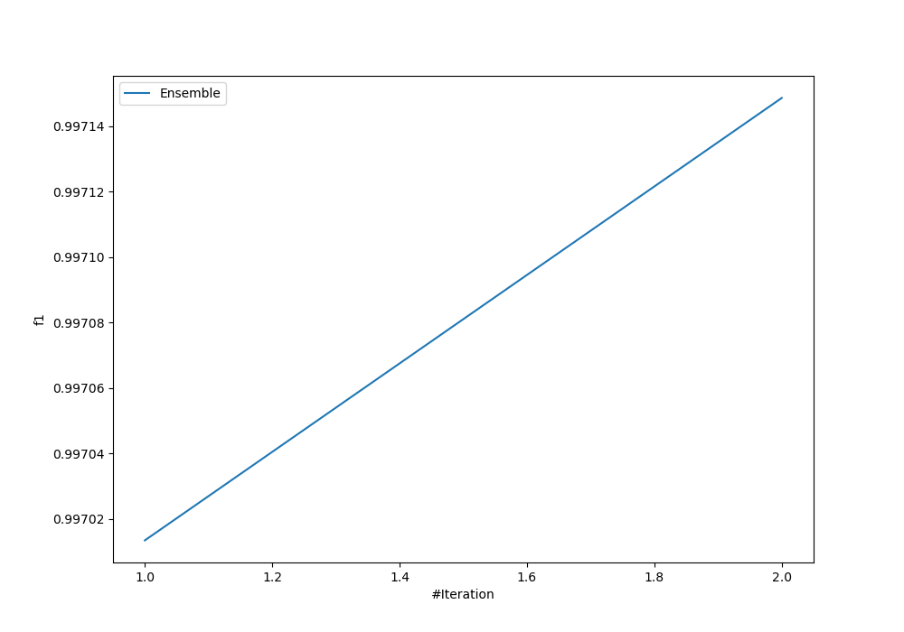
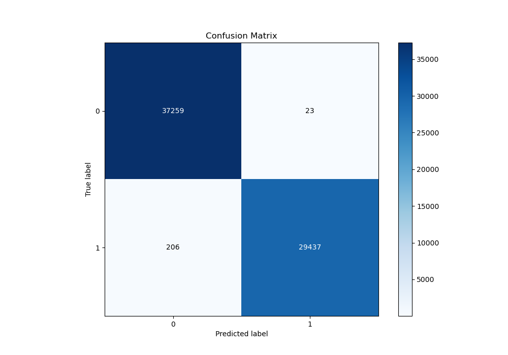
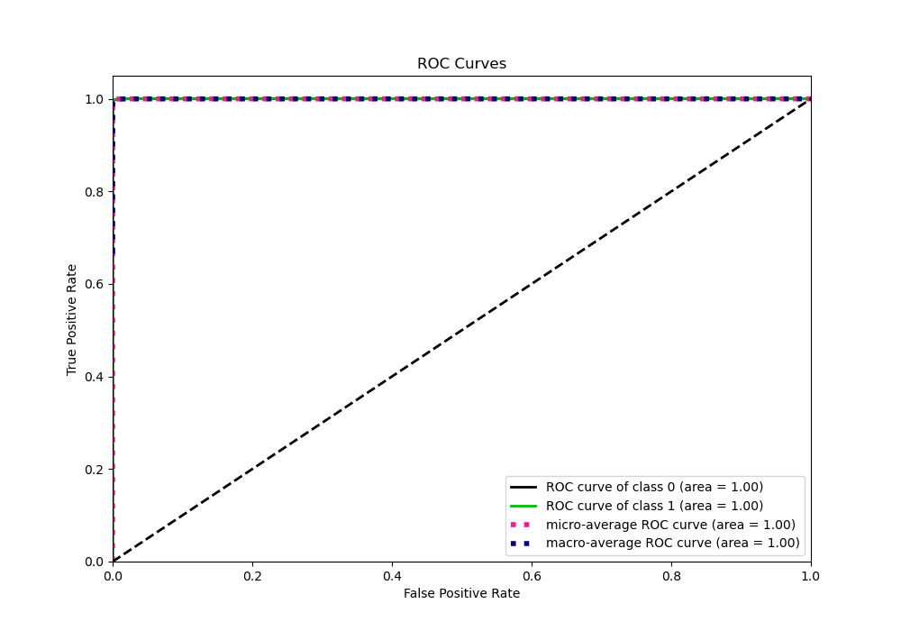
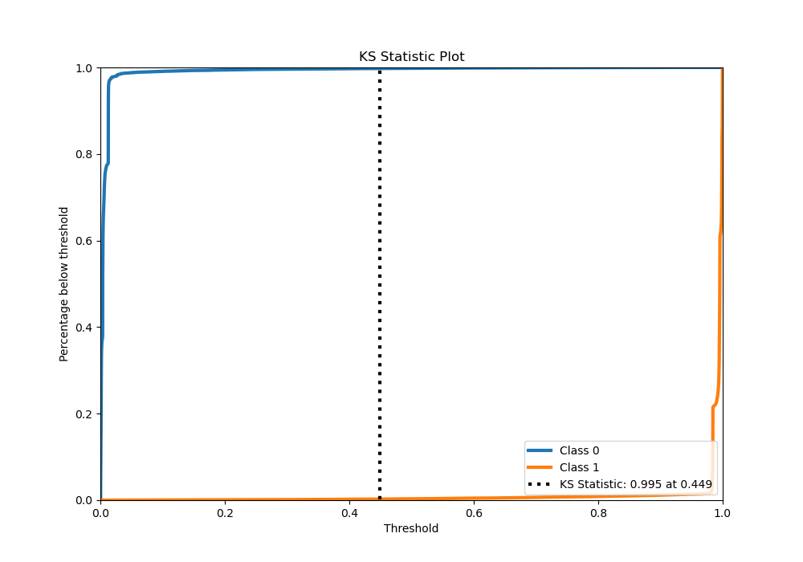
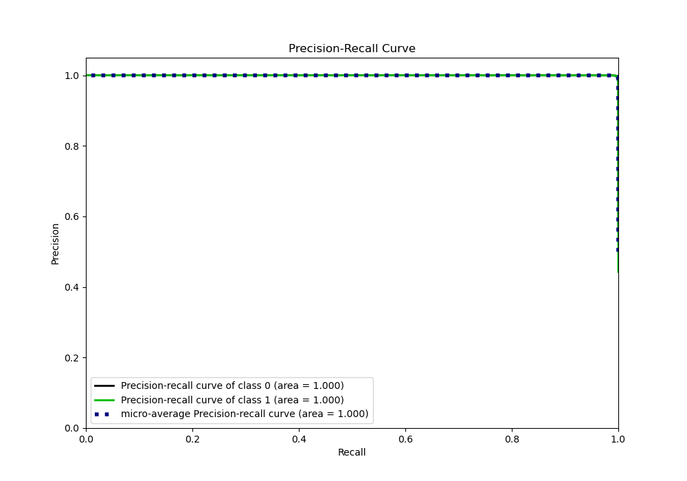
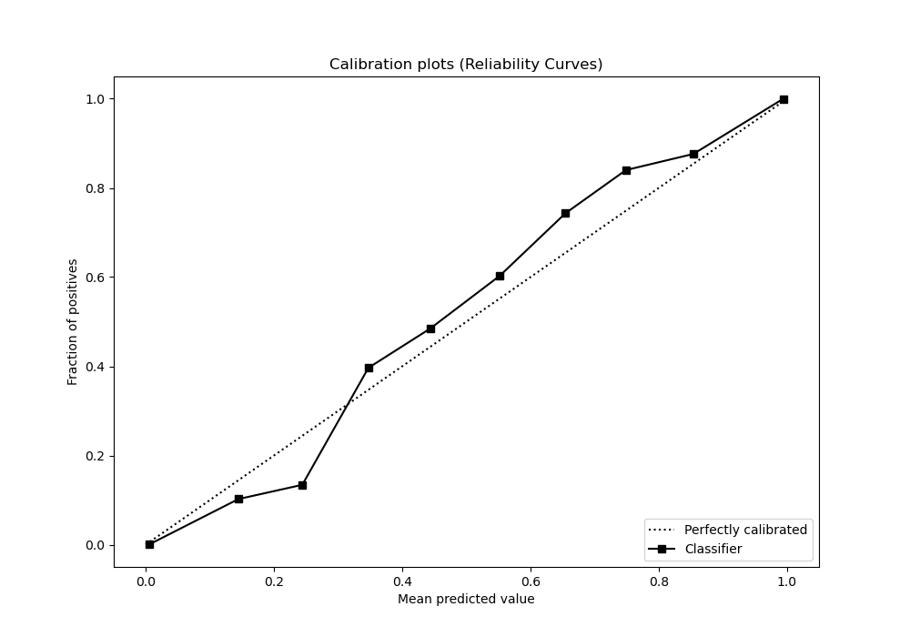
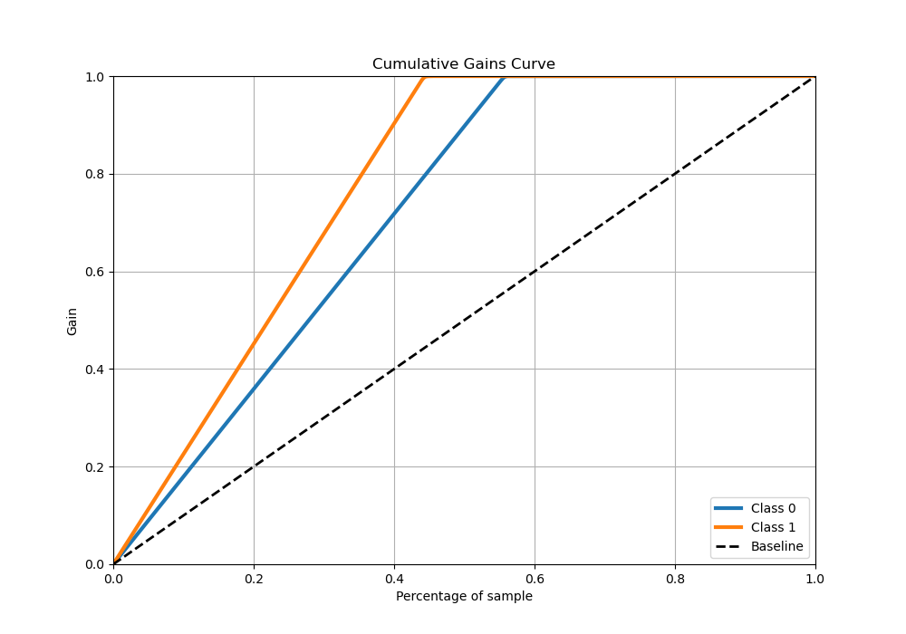
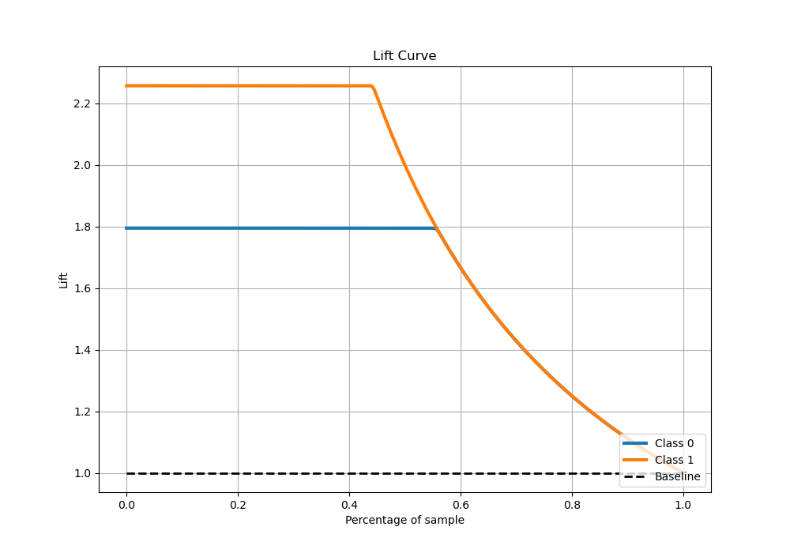

# Summary of Ensemble

[<< Go back](../README.md)

## Ensemble structure
| Model              |   Weight |
|:-------------------|---------:|
| 1_Default_LightGBM |        1 |
| 2_Xgboost          |        1 |

## Metric details
|           |     score |     threshold |
|:----------|----------:|--------------:|
| logloss   | 0.0114859 | nan           |
| auc       | 0.999956  | nan           |
| f1        | 0.996125  |   0.721818    |
| accuracy  | 0.996578  |   0.721818    |
| precision | 1         |   0.982899    |
| recall    | 1         |   0.000290194 |
| mcc       | 0.993077  |   0.721818    |

## Metric details with threshold from accuracy metric
|           |     score |   threshold |
|:----------|----------:|------------:|
| logloss   | 0.0114859 |  nan        |
| auc       | 0.999956  |  nan        |
| f1        | 0.996125  |    0.721818 |
| accuracy  | 0.996578  |    0.721818 |
| precision | 0.999219  |    0.721818 |
| recall    | 0.993051  |    0.721818 |
| mcc       | 0.993077  |    0.721818 |

## Confusion matrix (at threshold=0.721818)
|              |   Predicted as 0 |   Predicted as 1 |
|:-------------|-----------------:|-----------------:|
| Labeled as 0 |            37259 |               23 |
| Labeled as 1 |              206 |            29437 |

## Learning curves

## Confusion Matrix

## Normalized Confusion Matrix

## ROC Curve

## Kolmogorov-Smirnov Statistic

## Precision-Recall Curve

## Calibration Curve

## Cumulative Gains Curve

## Lift Curve

[<< Go back](../README.md)
