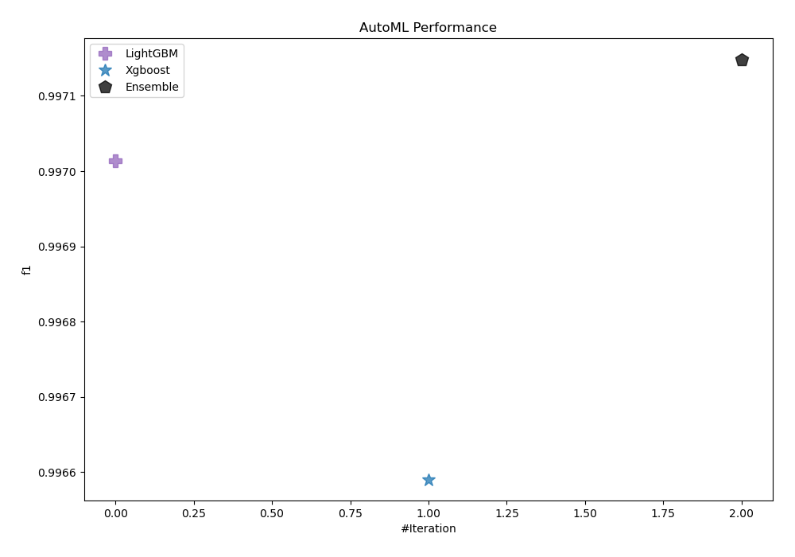
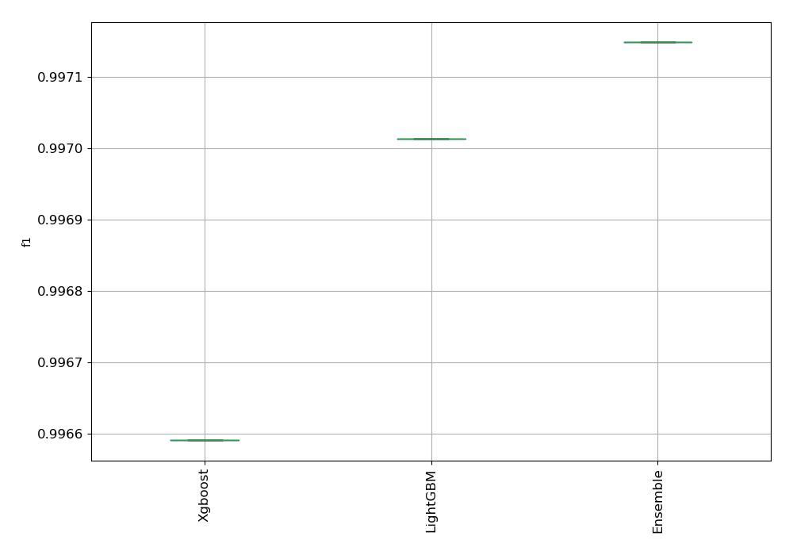
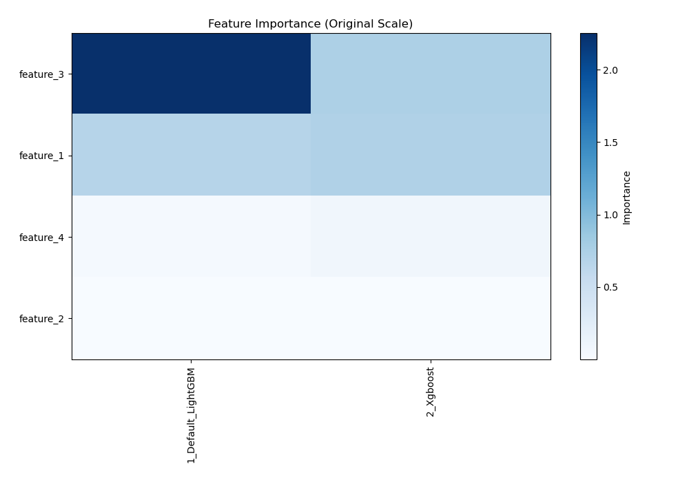
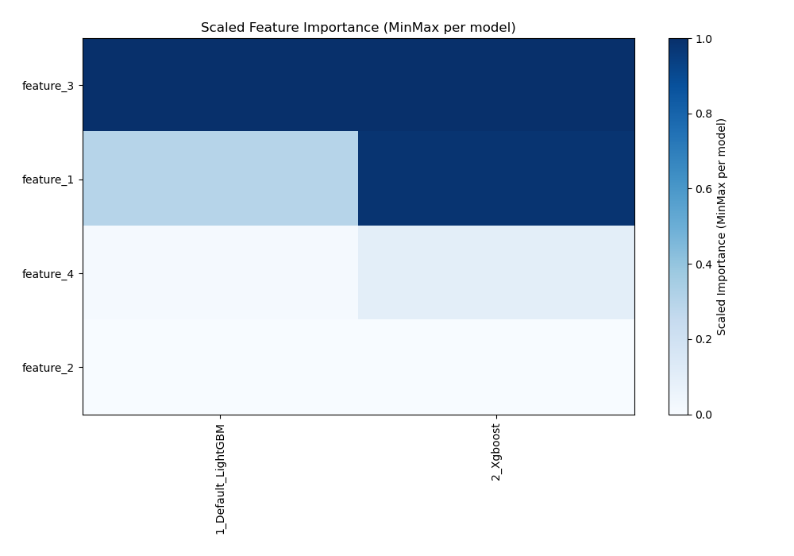
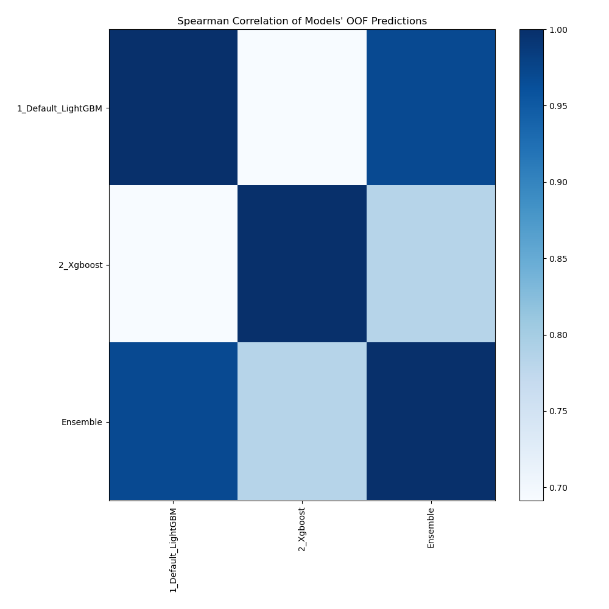

# AutoML Leaderboard

| Best model   | name                                               | model_type   | metric_type   |   metric_value |   train_time |   single_prediction_time |
|:-------------|:---------------------------------------------------|:-------------|:--------------|---------------:|-------------:|-------------------------:|
|              | [1_Default_LightGBM](1_Default_LightGBM/README.md) | LightGBM     | f1            |       0.997014 |       341.56 |                   0.084  |
|              | [2_Xgboost](2_Xgboost/README.md)                   | Xgboost      | f1            |       0.99659  |       196.33 |                   0.2666 |
| **the best** | [Ensemble](Ensemble/README.md)                     | Ensemble     | f1            |       0.997149 |        31.25 |                   0.4946 |

### AutoML Performance

### AutoML Performance Boxplot

### Features Importance (Original Scale)

### Scaled Features Importance (MinMax per Model)

### Spearman Correlation of Models

