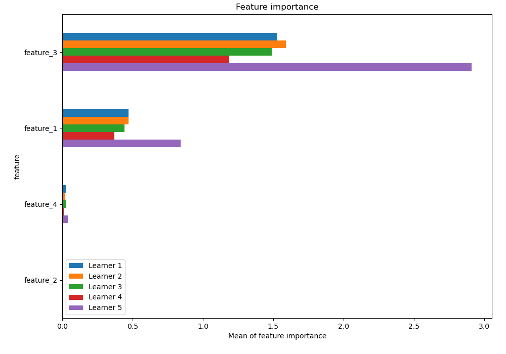
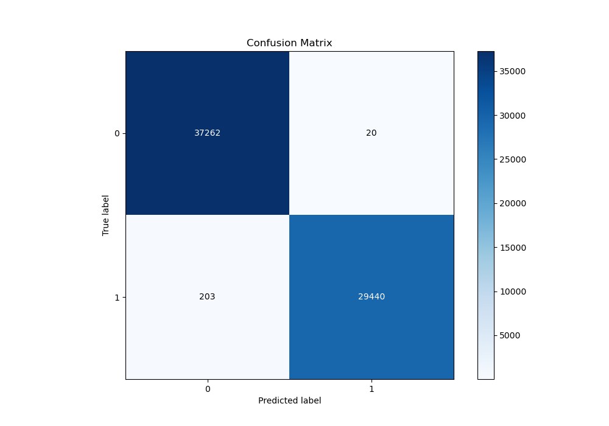
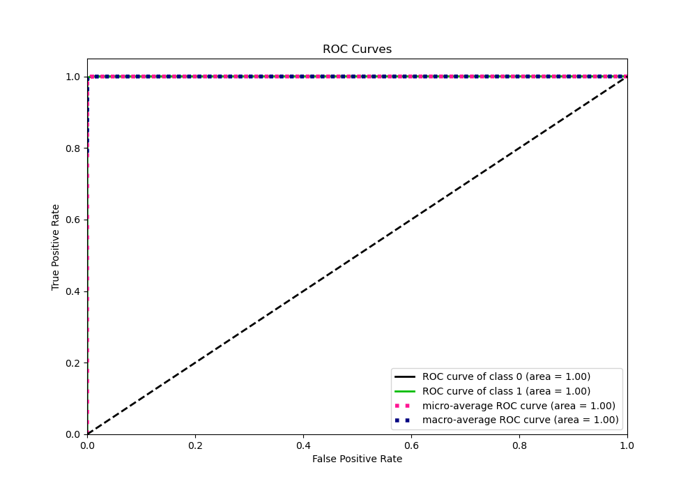
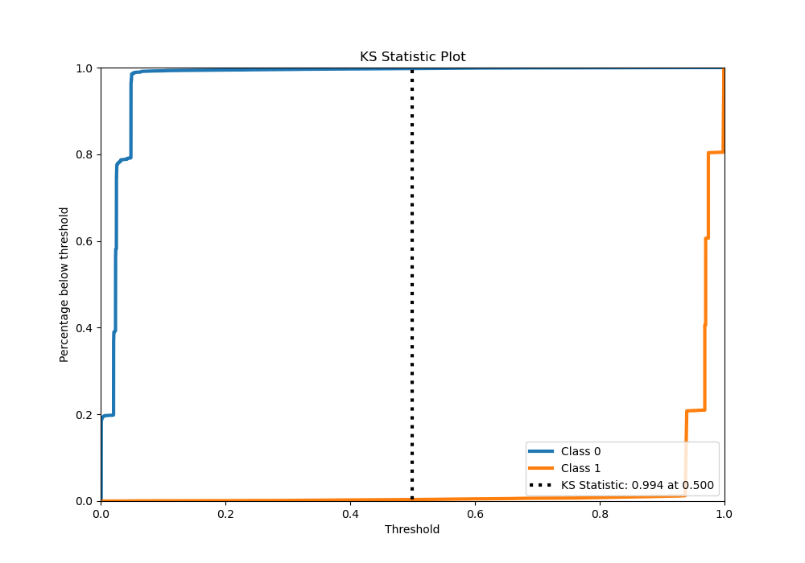
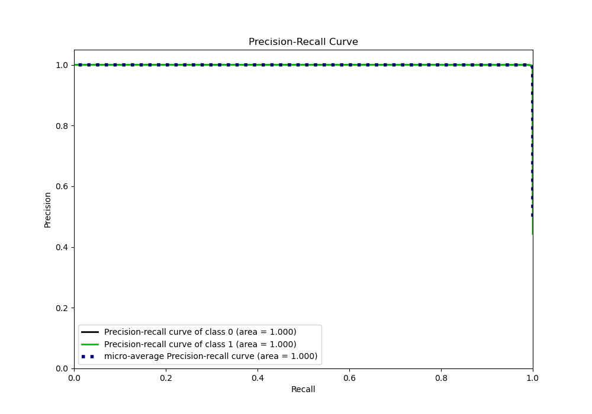
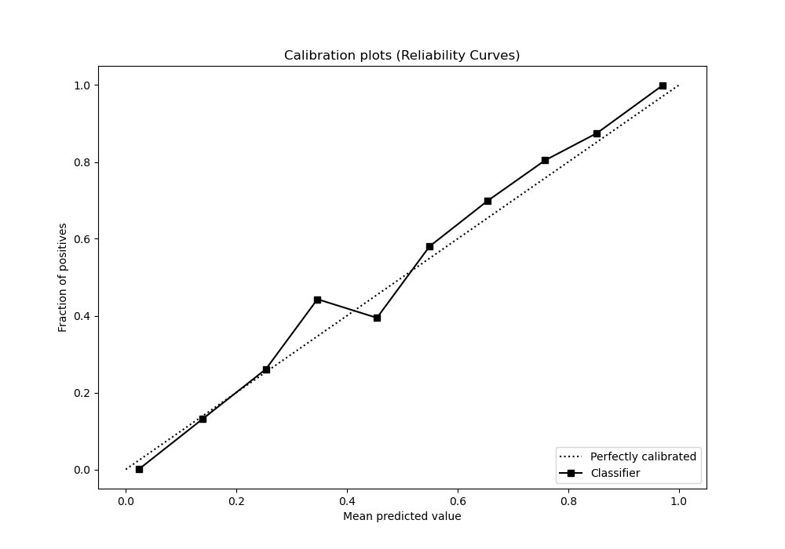
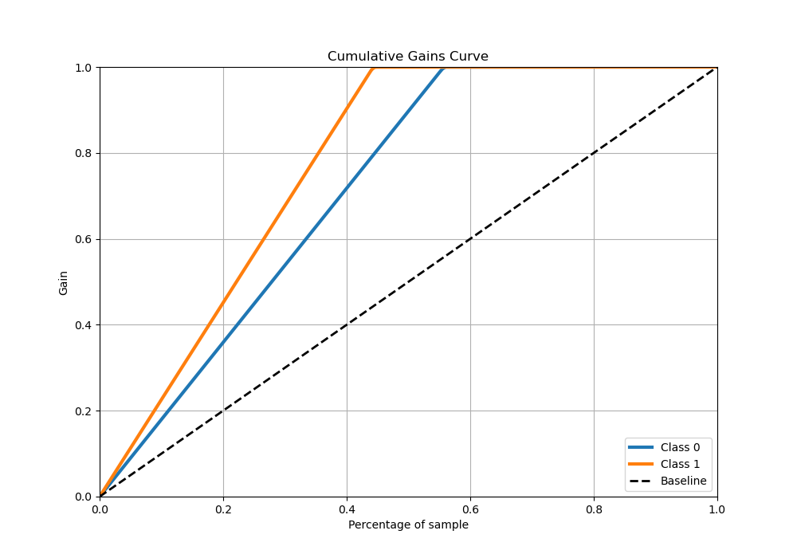
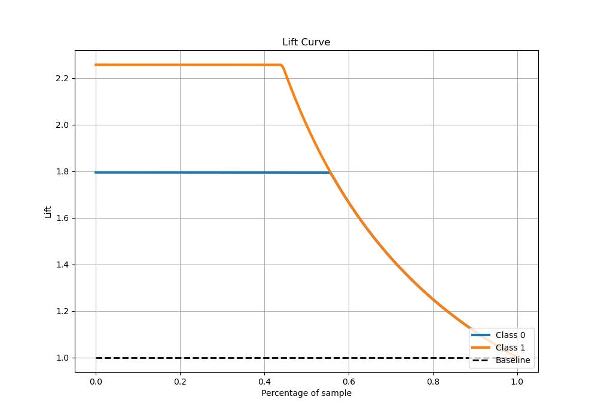

# Summary of 4_LightGBM

[<< Go back](../README.md)

## LightGBM
- **n_jobs**: -1
- **objective**: binary
- **num_leaves**: 31
- **learning_rate**: 0.05
- **feature_fraction**: 0.9
- **bagging_fraction**: 0.9
- **min_data_in_leaf**: 10
- **metric**: custom
- **custom_eval_metric_name**: accuracy
- **explain_level**: 1

## Validation
 - **validation_type**: kfold
 - **k_folds**: 5
 - **shuffle**: True

## Optimized metric
accuracy

## Training time

68.8 seconds

## Metric details
|           |     score |     threshold |
|:----------|----------:|--------------:|
| logloss   | 0.0327974 | nan           |
| auc       | 0.999922  | nan           |
| f1        | 0.996227  |   0.731332    |
| accuracy  | 0.996668  |   0.731332    |
| precision | 1         |   0.958866    |
| recall    | 1         |   0.000571302 |
| mcc       | 0.993259  |   0.731332    |

## Metric details with threshold from accuracy metric
|           |     score |   threshold |
|:----------|----------:|------------:|
| logloss   | 0.0327974 |  nan        |
| auc       | 0.999922  |  nan        |
| f1        | 0.996227  |    0.731332 |
| accuracy  | 0.996668  |    0.731332 |
| precision | 0.999321  |    0.731332 |
| recall    | 0.993152  |    0.731332 |
| mcc       | 0.993259  |    0.731332 |

## Confusion matrix (at threshold=0.731332)
|              |   Predicted as 0 |   Predicted as 1 |
|:-------------|-----------------:|-----------------:|
| Labeled as 0 |            37262 |               20 |
| Labeled as 1 |              203 |            29440 |

## Learning curves

## Permutation-based Importance

## Confusion Matrix

## Normalized Confusion Matrix

## ROC Curve

## Kolmogorov-Smirnov Statistic

## Precision-Recall Curve

## Calibration Curve

## Cumulative Gains Curve

## Lift Curve

[<< Go back](../README.md)
