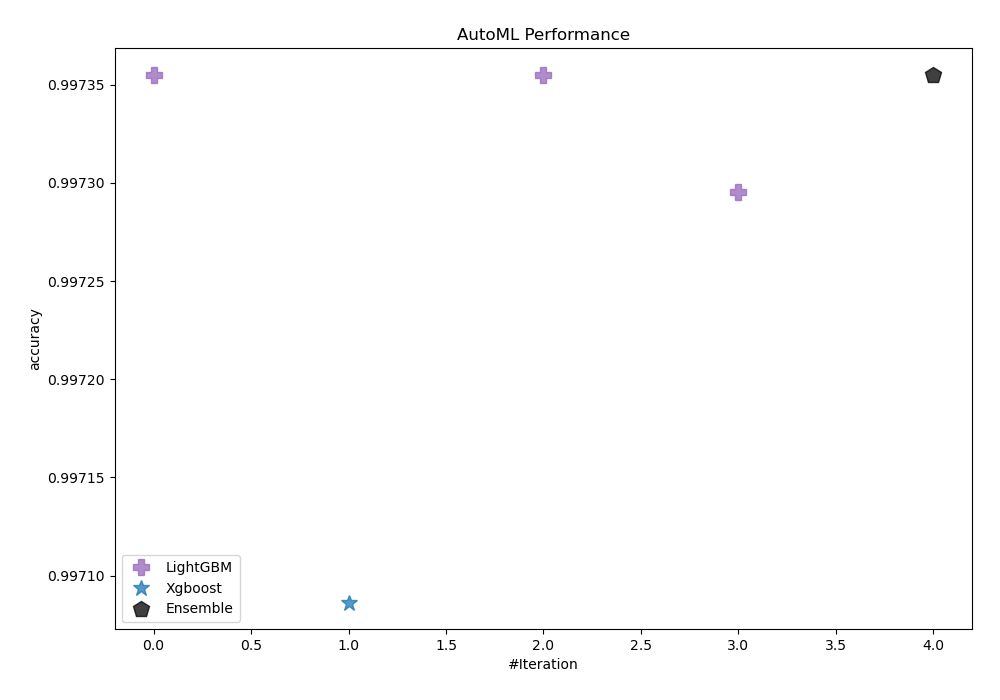
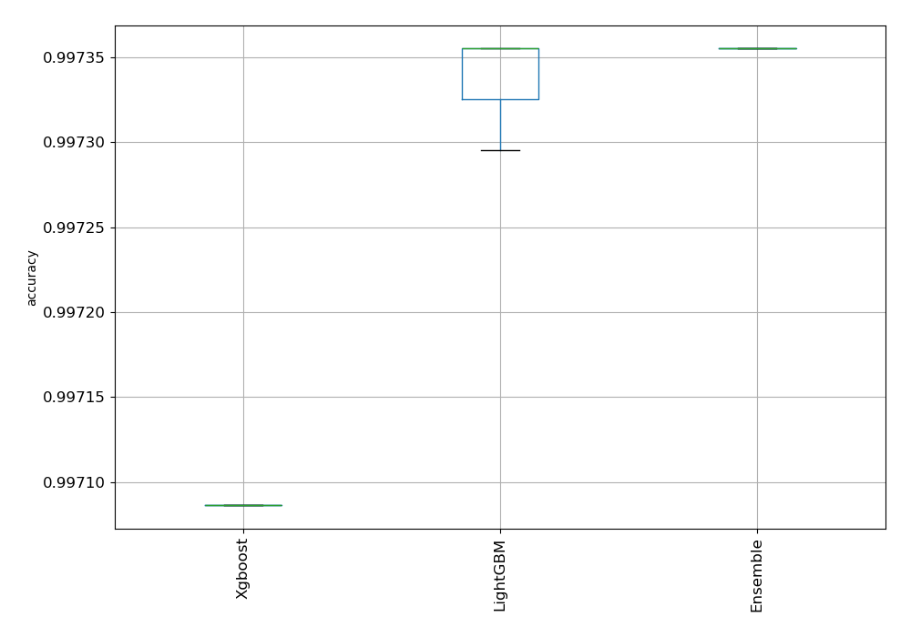
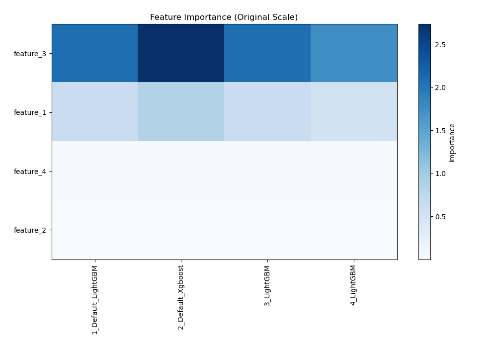
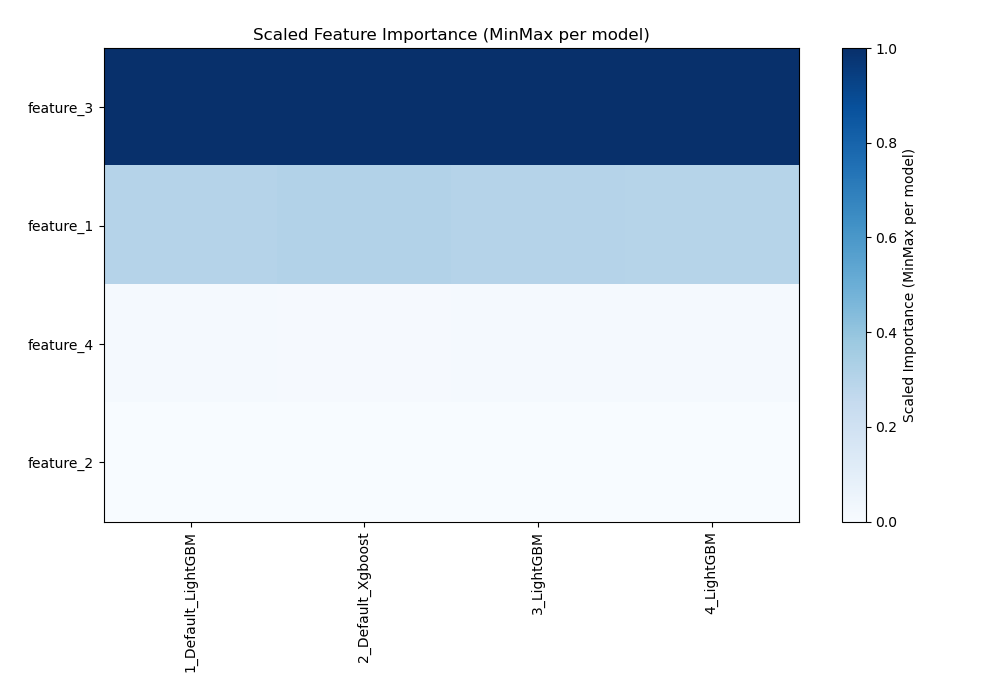

# AutoML Leaderboard

| Best model   | name                                               | model_type   | metric_type   |   metric_value |   train_time |   single_prediction_time |
|:-------------|:---------------------------------------------------|:-------------|:--------------|---------------:|-------------:|-------------------------:|
| **the best** | [1_Default_LightGBM](1_Default_LightGBM/README.md) | LightGBM     | accuracy      |       0.997355 |       154.61 |                   0.0784 |
|              | [2_Default_Xgboost](2_Default_Xgboost/README.md)   | Xgboost      | accuracy      |       0.997086 |       177.11 |                   0.4398 |
|              | [3_LightGBM](3_LightGBM/README.md)                 | LightGBM     | accuracy      |       0.997355 |       114.48 |                   0.0626 |
|              | [4_LightGBM](4_LightGBM/README.md)                 | LightGBM     | accuracy      |       0.997295 |        72.32 |                   0.0457 |
|              | [Ensemble](Ensemble/README.md)                     | Ensemble     | accuracy      |       0.997355 |        15.24 |                   0.0666 |

### AutoML Performance

### AutoML Performance Boxplot

### Features Importance (Original Scale)

### Scaled Features Importance (MinMax per Model)

### Spearman Correlation of Models

