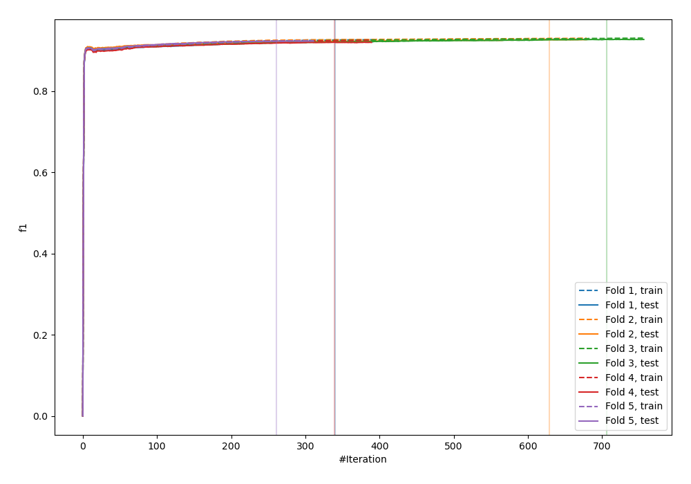
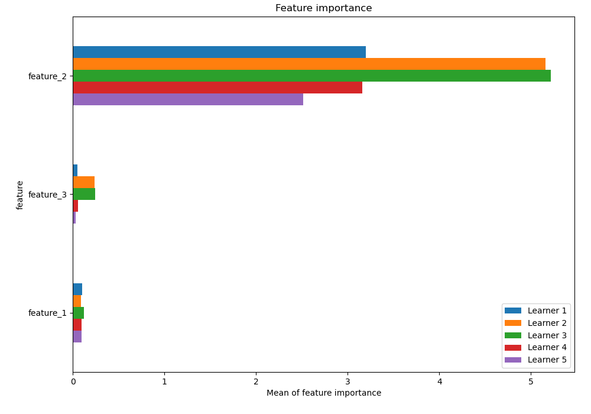
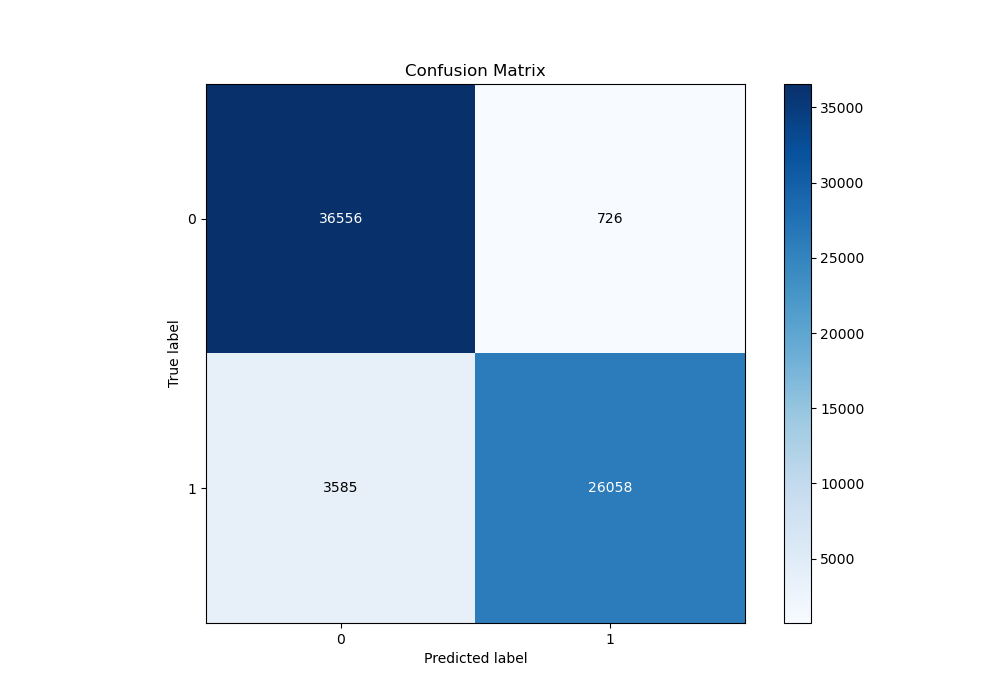
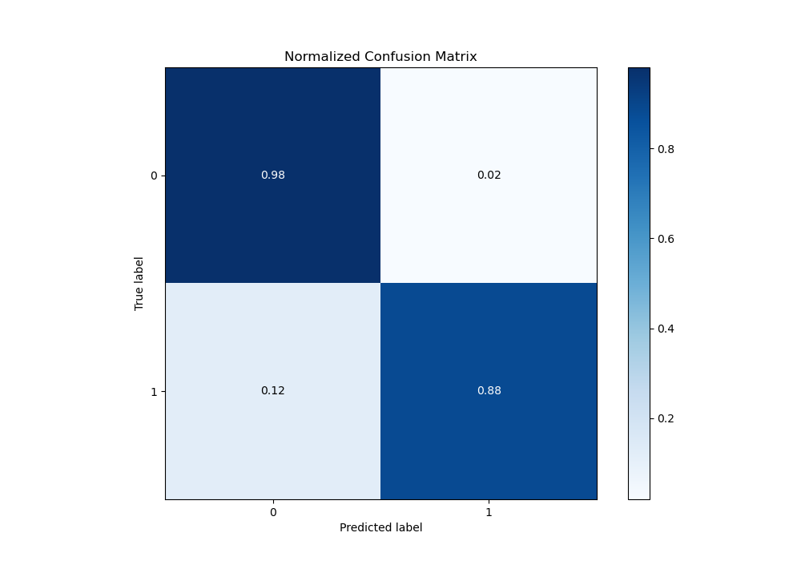
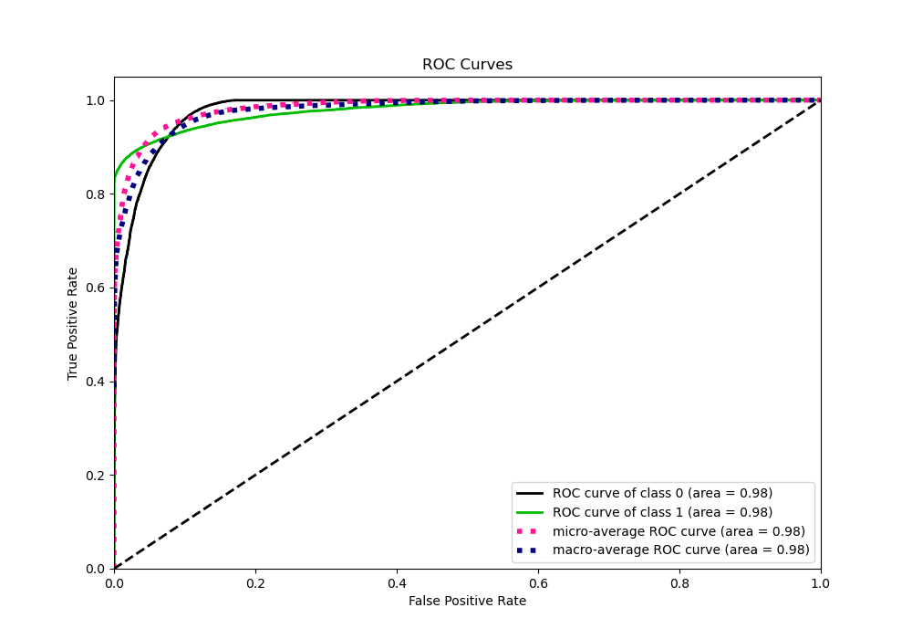
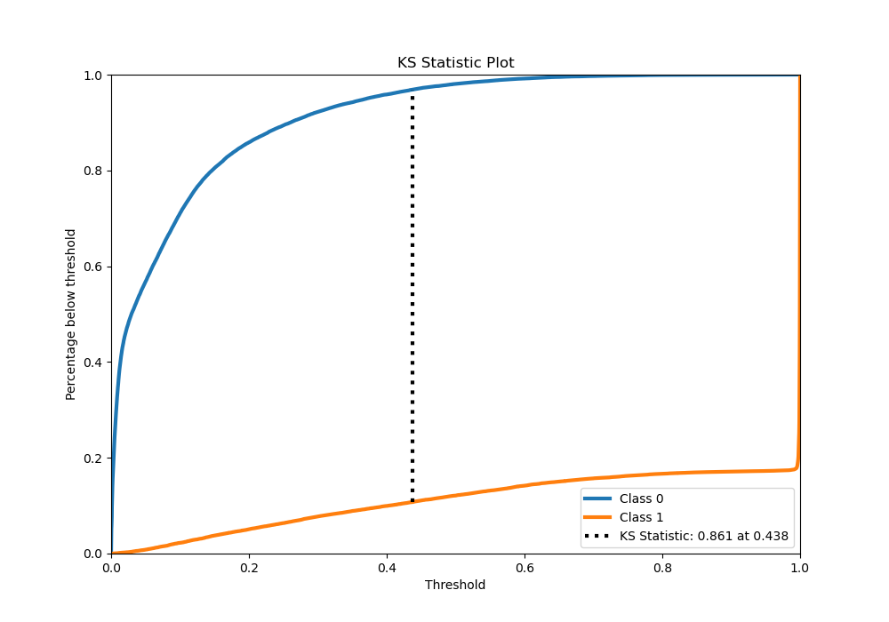
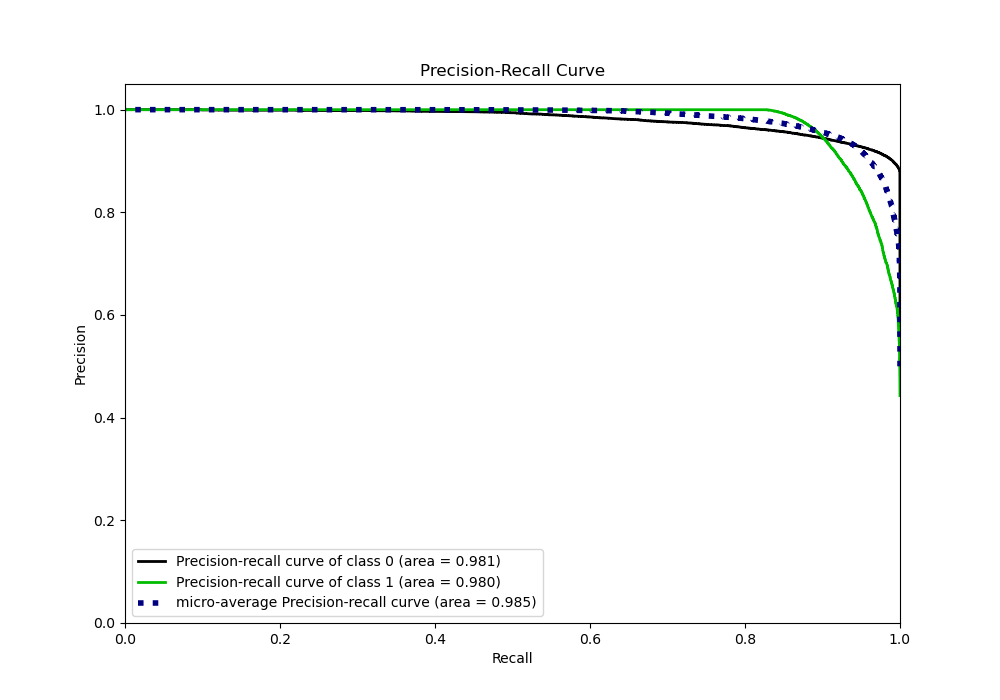
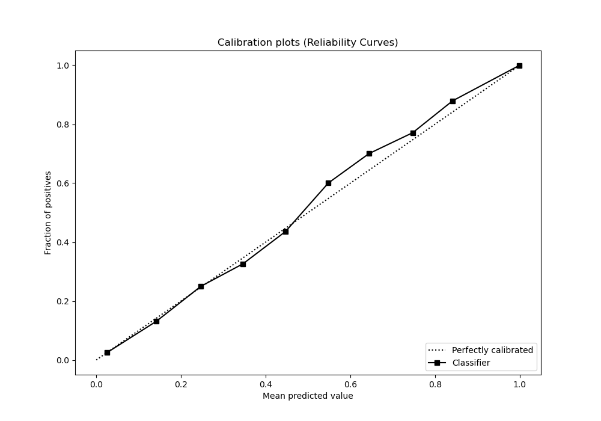
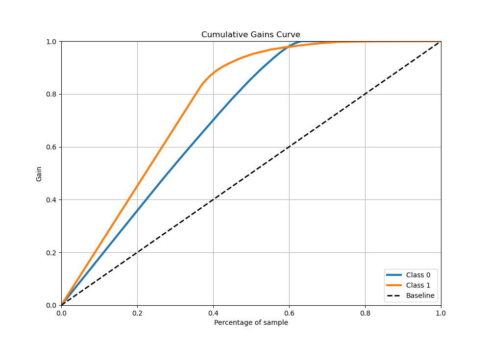
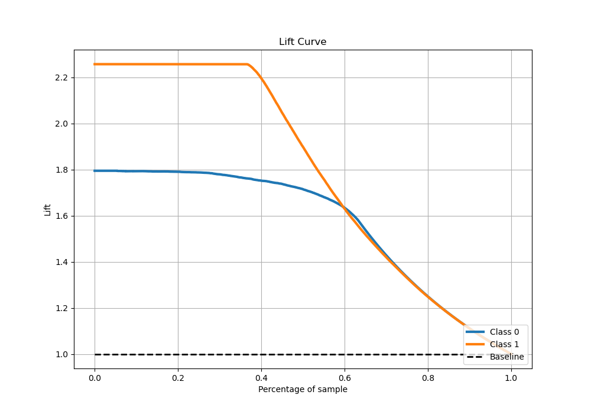

# Summary of 2_Xgboost

[<< Go back](../README.md)

## Extreme Gradient Boosting (Xgboost)
- **n_jobs**: -1
- **objective**: binary:logistic
- **eta**: 0.1
- **max_depth**: 7
- **min_child_weight**: 10
- **subsample**: 0.8
- **colsample_bytree**: 0.5
- **eval_metric**: f1
- **explain_level**: 1

## Validation
 - **validation_type**: kfold
 - **k_folds**: 5
 - **shuffle**: True

## Optimized metric
f1

## Training time

233.4 seconds

## Metric details
|           |    score |    threshold |
|:----------|---------:|-------------:|
| logloss   | 0.157851 | nan          |
| auc       | 0.97962  | nan          |
| f1        | 0.923883 |   0.447726   |
| accuracy  | 0.935585 |   0.498526   |
| precision | 1        |   0.999077   |
| recall    | 1        |   1.4505e-07 |
| mcc       | 0.871503 |   0.498526   |

## Metric details with threshold from accuracy metric
|           |    score |   threshold |
|:----------|---------:|------------:|
| logloss   | 0.157851 |  nan        |
| auc       | 0.97962  |  nan        |
| f1        | 0.9236   |    0.498526 |
| accuracy  | 0.935585 |    0.498526 |
| precision | 0.972894 |    0.498526 |
| recall    | 0.879061 |    0.498526 |
| mcc       | 0.871503 |    0.498526 |

## Confusion matrix (at threshold=0.498526)
|              |   Predicted as 0 |   Predicted as 1 |
|:-------------|-----------------:|-----------------:|
| Labeled as 0 |            36556 |              726 |
| Labeled as 1 |             3585 |            26058 |

## Learning curves

## Permutation-based Importance

## Confusion Matrix

## Normalized Confusion Matrix

## ROC Curve

## Kolmogorov-Smirnov Statistic

## Precision-Recall Curve

## Calibration Curve

## Cumulative Gains Curve

## Lift Curve

[<< Go back](../README.md)
