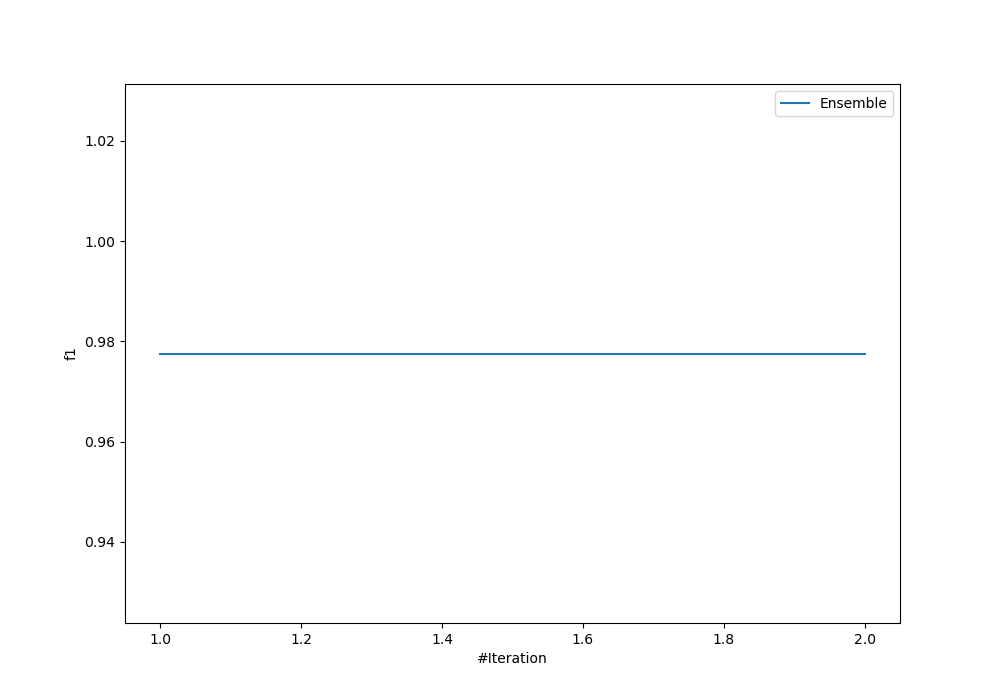
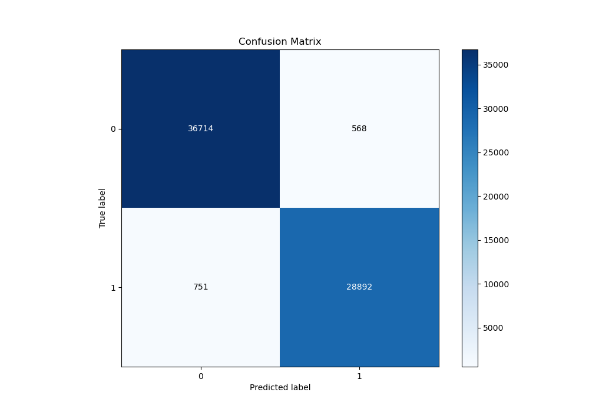
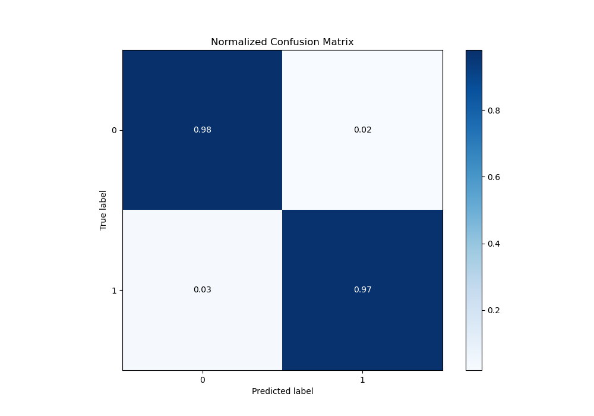
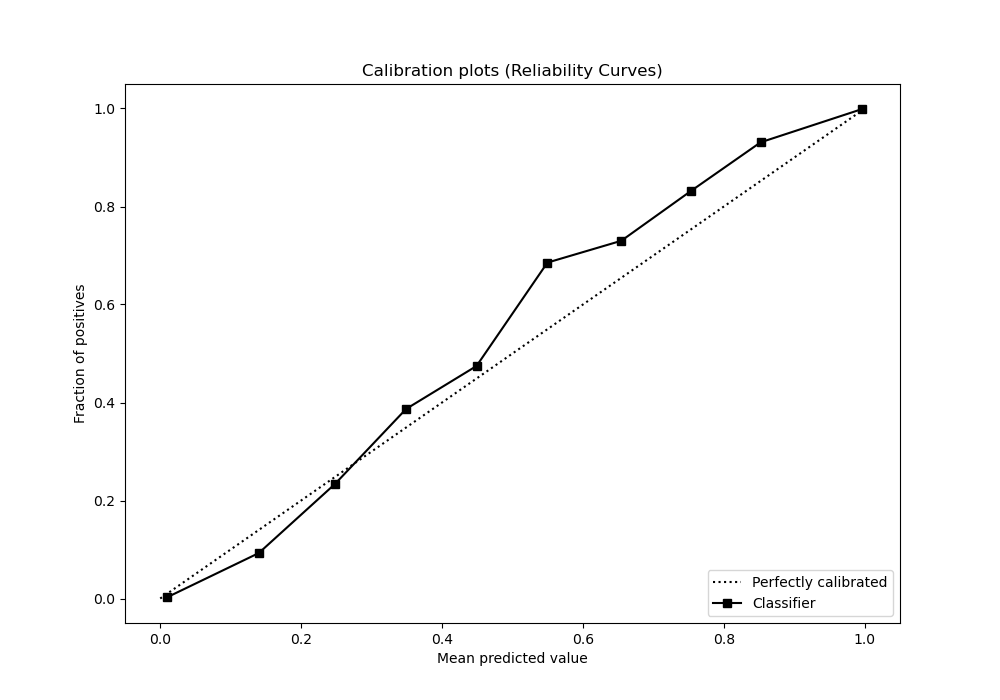

# Summary of Ensemble

[<< Go back](../README.md)

## Ensemble structure
| Model             |   Weight |
|:------------------|---------:|
| 1_Default_Xgboost |        1 |

## Metric details
|           |     score |     threshold |
|:----------|----------:|--------------:|
| logloss   | 0.0541147 | nan           |
| auc       | 0.998352  | nan           |
| f1        | 0.977683  |   0.489849    |
| accuracy  | 0.980291  |   0.489849    |
| precision | 1         |   0.999859    |
| recall    | 1         |   5.97932e-17 |
| mcc       | 0.960052  |   0.489849    |

## Metric details with threshold from accuracy metric
|           |     score |   threshold |
|:----------|----------:|------------:|
| logloss   | 0.0541147 |  nan        |
| auc       | 0.998352  |  nan        |
| f1        | 0.977683  |    0.489849 |
| accuracy  | 0.980291  |    0.489849 |
| precision | 0.98072   |    0.489849 |
| recall    | 0.974665  |    0.489849 |
| mcc       | 0.960052  |    0.489849 |

## Confusion matrix (at threshold=0.489849)
|              |   Predicted as 0 |   Predicted as 1 |
|:-------------|-----------------:|-----------------:|
| Labeled as 0 |            36714 |              568 |
| Labeled as 1 |              751 |            28892 |

## Learning curves

## Confusion Matrix

## Normalized Confusion Matrix

## ROC Curve

## Kolmogorov-Smirnov Statistic

## Precision-Recall Curve

## Calibration Curve

## Cumulative Gains Curve

## Lift Curve

[<< Go back](../README.md)
