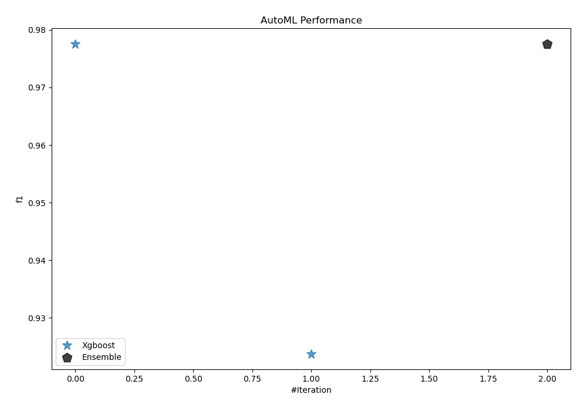
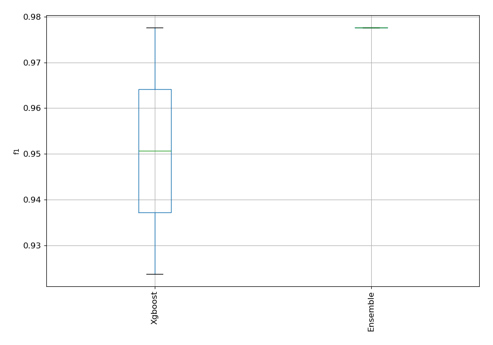
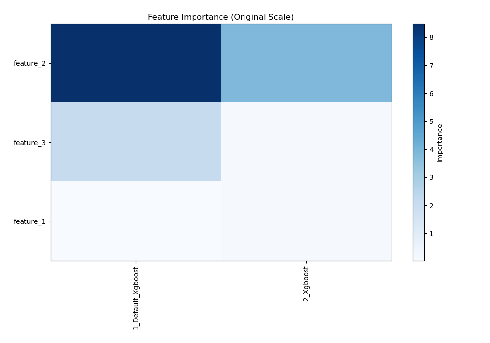
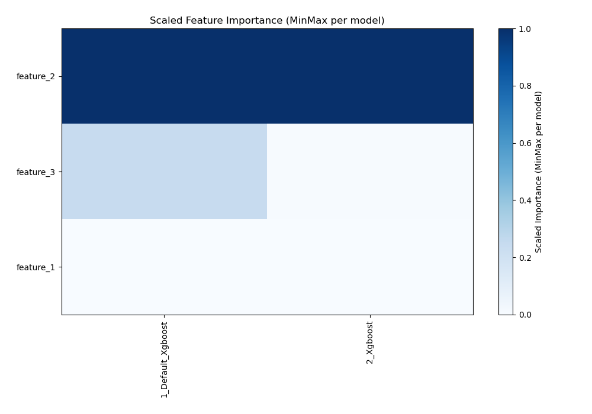
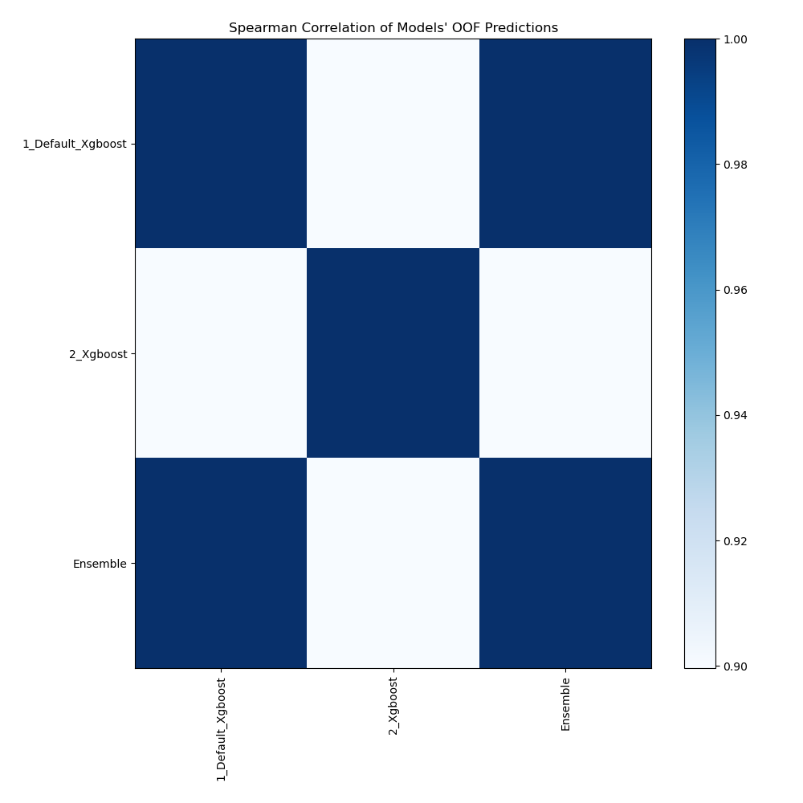

# AutoML Leaderboard

| Best model   | name                                             | model_type   | metric_type   |   metric_value |   train_time |   single_prediction_time |
|:-------------|:-------------------------------------------------|:-------------|:--------------|---------------:|-------------:|-------------------------:|
| **the best** | [1_Default_Xgboost](1_Default_Xgboost/README.md) | Xgboost      | f1            |       0.977596 |       304.47 |                   0.0653 |
|              | [2_Xgboost](2_Xgboost/README.md)                 | Xgboost      | f1            |       0.92374  |       238.72 |                   0.0569 |
|              | [Ensemble](Ensemble/README.md)                   | Ensemble     | f1            |       0.977596 |        20.51 |                   0.0569 |

### AutoML Performance

### AutoML Performance Boxplot

### Features Importance (Original Scale)

### Scaled Features Importance (MinMax per Model)

### Spearman Correlation of Models

