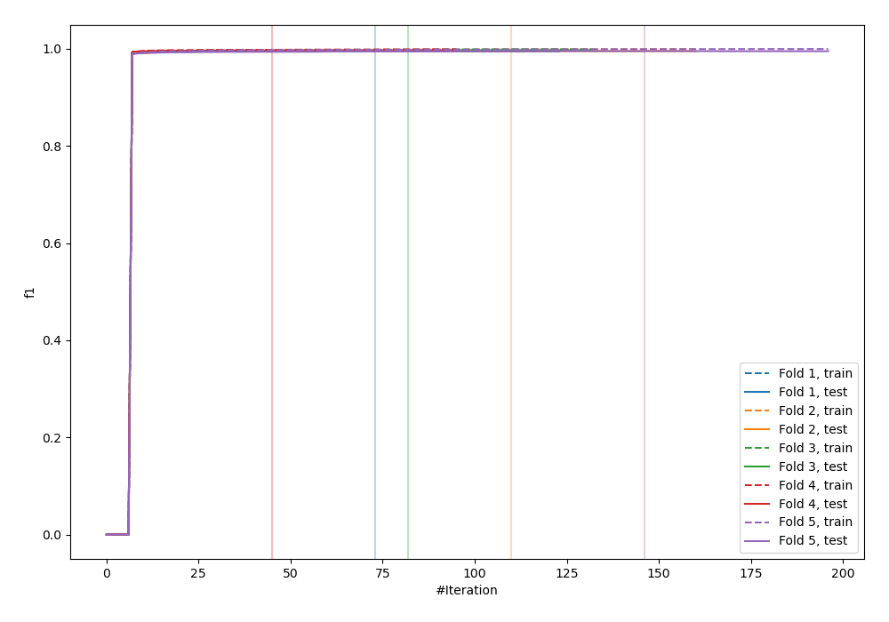
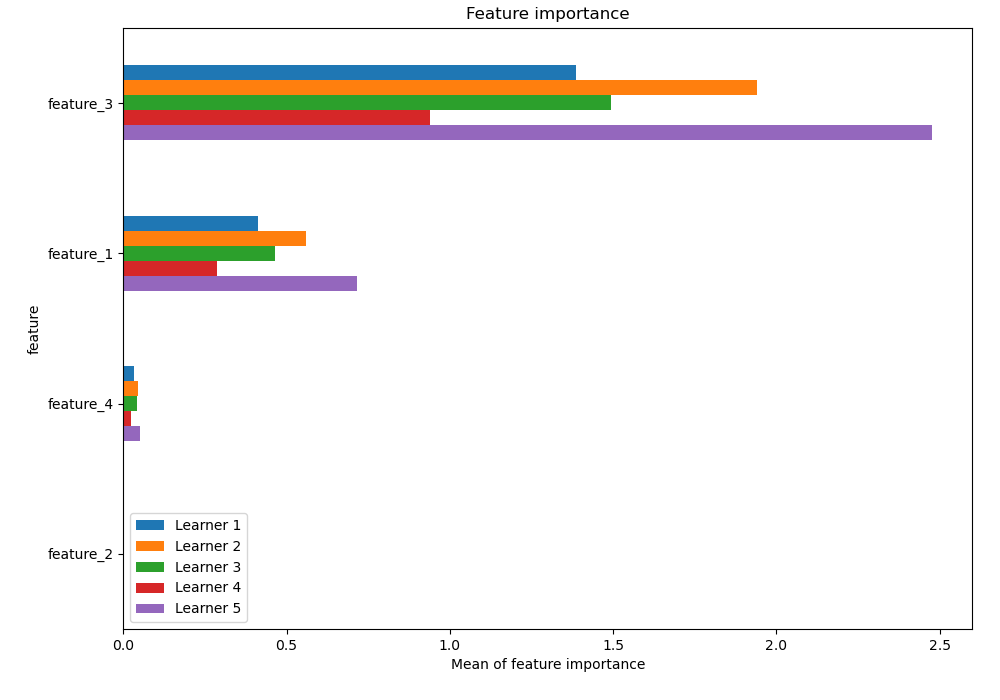
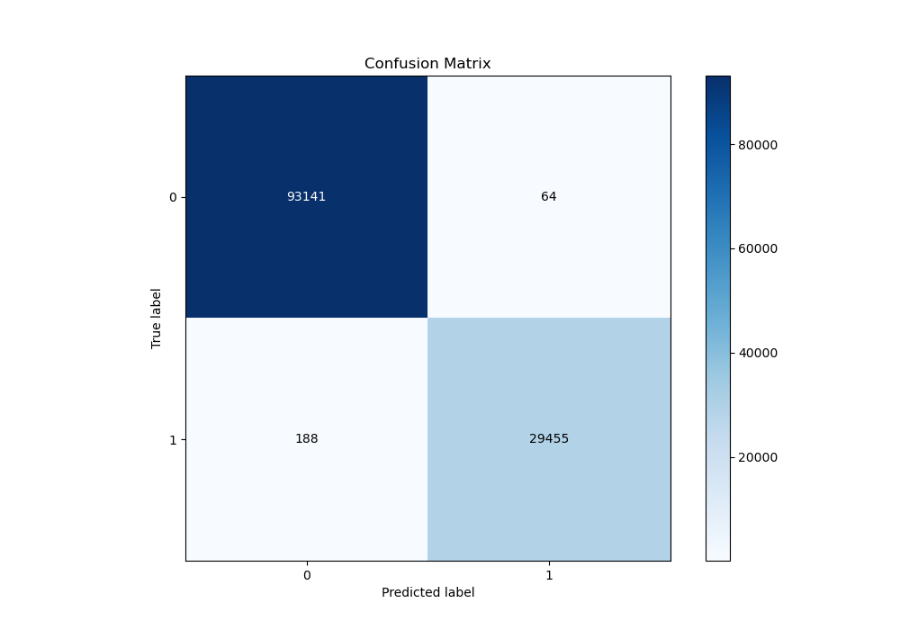
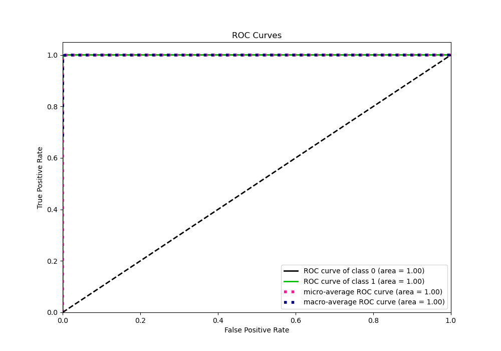
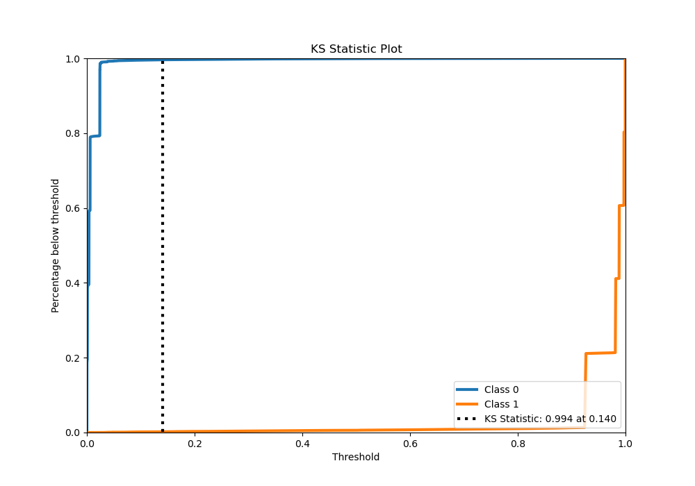
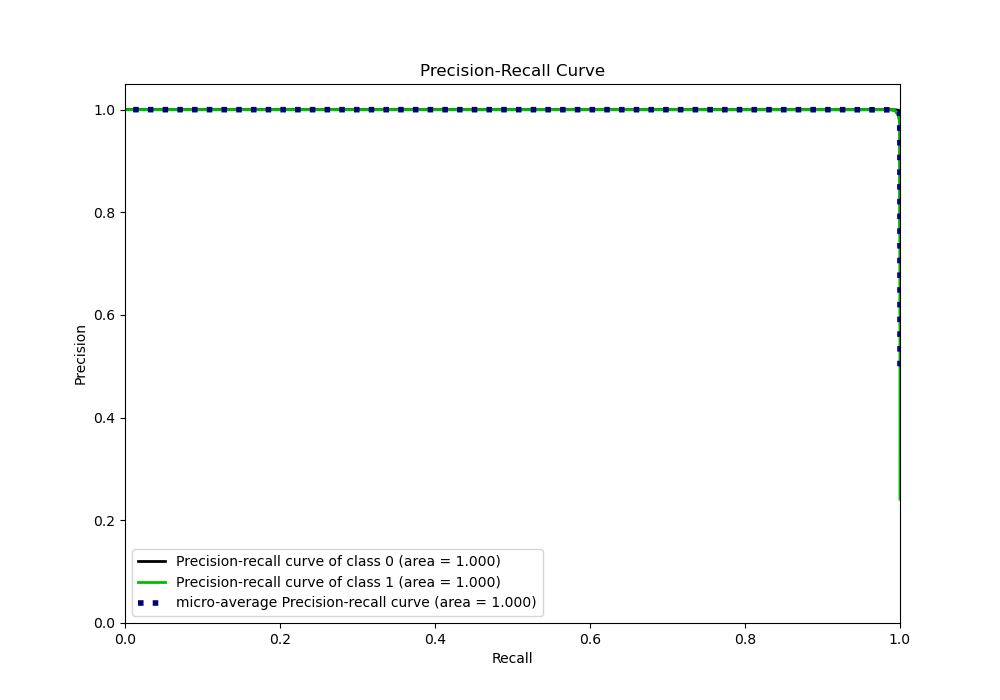
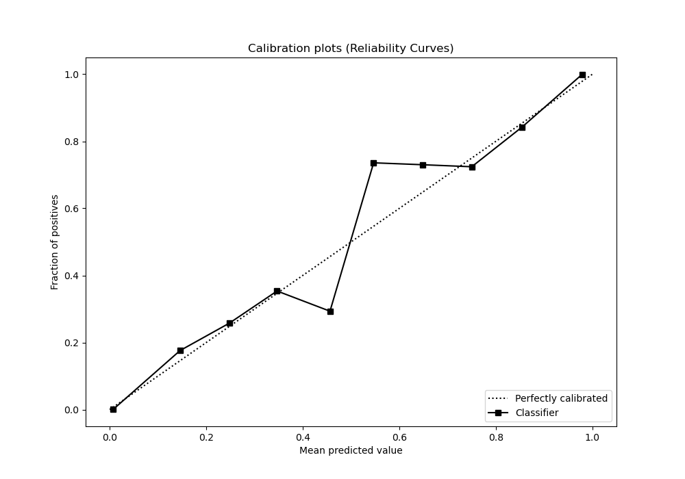
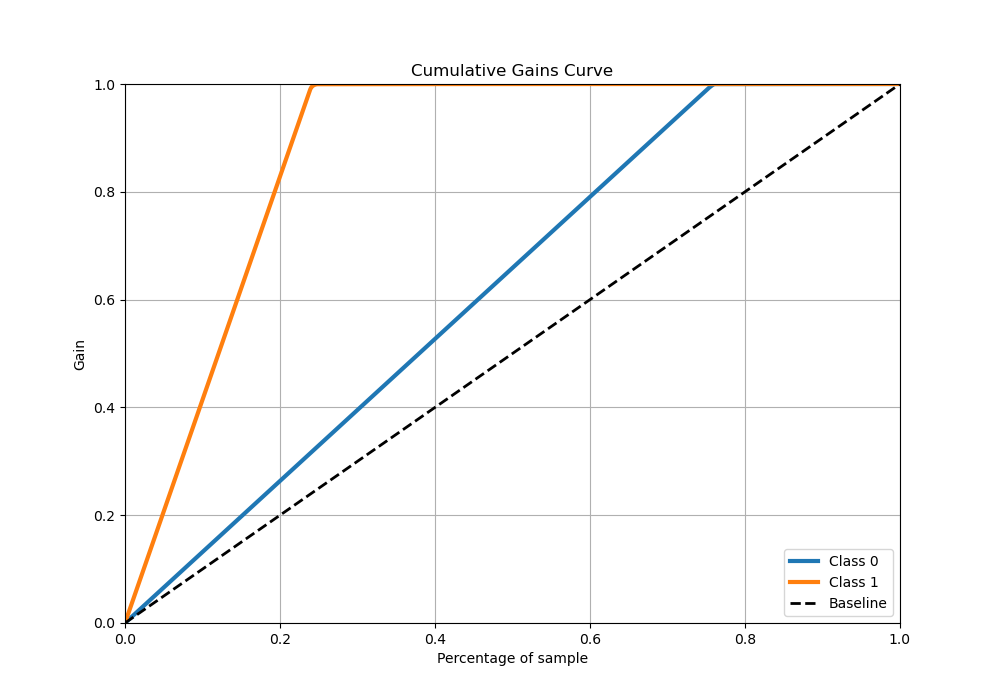
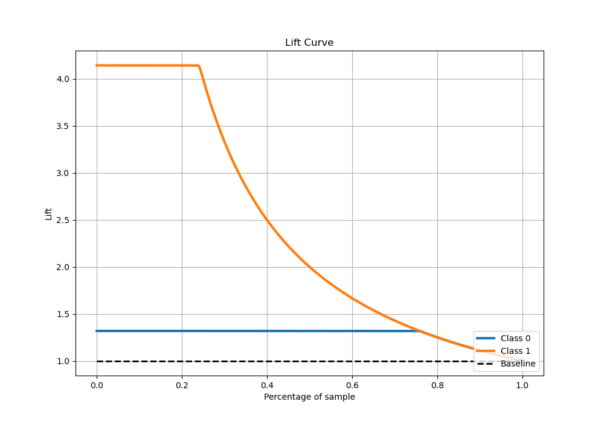

# Summary of 1_Default_LightGBM

[<< Go back](../README.md)

## LightGBM
- **n_jobs**: -1
- **objective**: binary
- **num_leaves**: 63
- **learning_rate**: 0.05
- **feature_fraction**: 0.9
- **bagging_fraction**: 0.9
- **min_data_in_leaf**: 10
- **metric**: custom
- **custom_eval_metric_name**: f1
- **explain_level**: 1

## Validation
 - **validation_type**: kfold
 - **k_folds**: 5
 - **shuffle**: True

## Optimized metric
f1

## Training time

352.0 seconds

## Metric details
|           |    score |     threshold |
|:----------|---------:|--------------:|
| logloss   | 0.015642 | nan           |
| auc       | 0.999919 | nan           |
| f1        | 0.995741 |   0.514052    |
| accuracy  | 0.997949 |   0.514052    |
| precision | 1        |   0.981901    |
| recall    | 1        |   7.13682e-05 |
| mcc       | 0.994393 |   0.514052    |

## Metric details with threshold from accuracy metric
|           |    score |   threshold |
|:----------|---------:|------------:|
| logloss   | 0.015642 |  nan        |
| auc       | 0.999919 |  nan        |
| f1        | 0.995741 |    0.514052 |
| accuracy  | 0.997949 |    0.514052 |
| precision | 0.997832 |    0.514052 |
| recall    | 0.993658 |    0.514052 |
| mcc       | 0.994393 |    0.514052 |

## Confusion matrix (at threshold=0.514052)
|              |   Predicted as 0 |   Predicted as 1 |
|:-------------|-----------------:|-----------------:|
| Labeled as 0 |            93141 |               64 |
| Labeled as 1 |              188 |            29455 |

## Learning curves

## Permutation-based Importance

## Confusion Matrix

## Normalized Confusion Matrix

## ROC Curve

## Kolmogorov-Smirnov Statistic

## Precision-Recall Curve

## Calibration Curve

## Cumulative Gains Curve

## Lift Curve

[<< Go back](../README.md)
