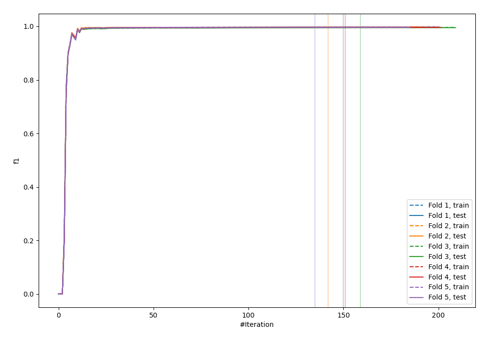
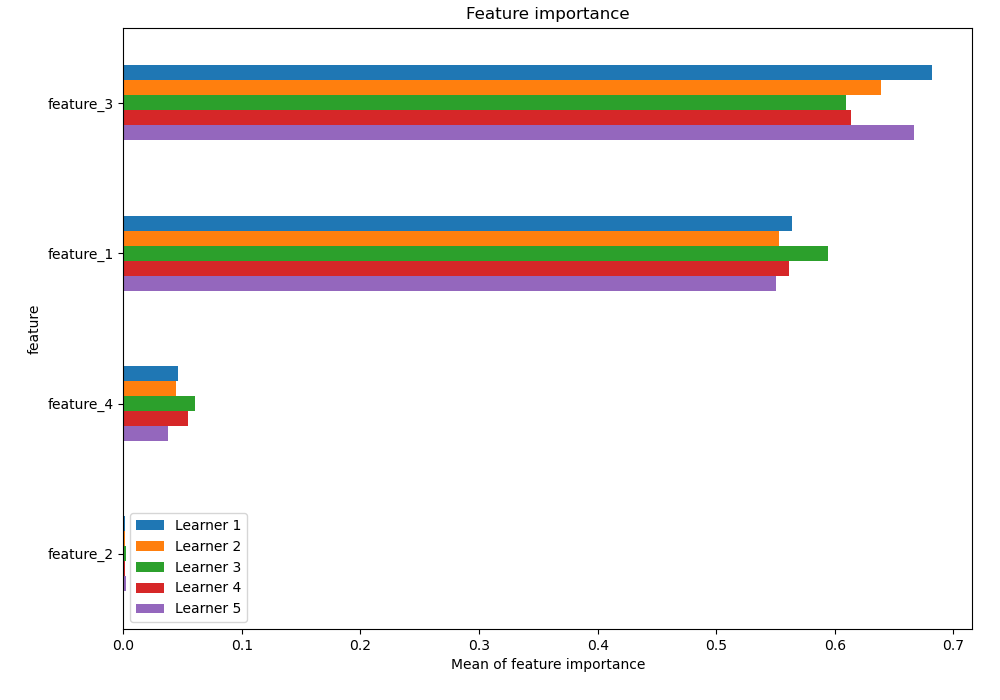
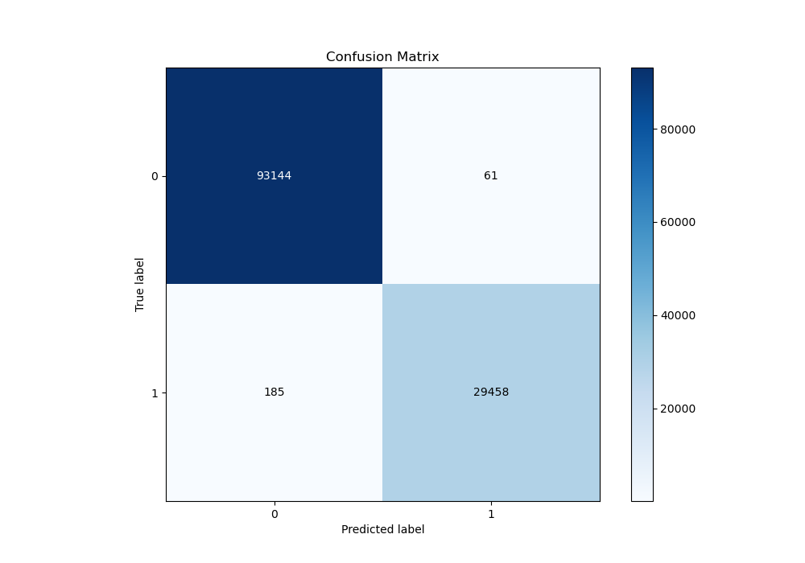
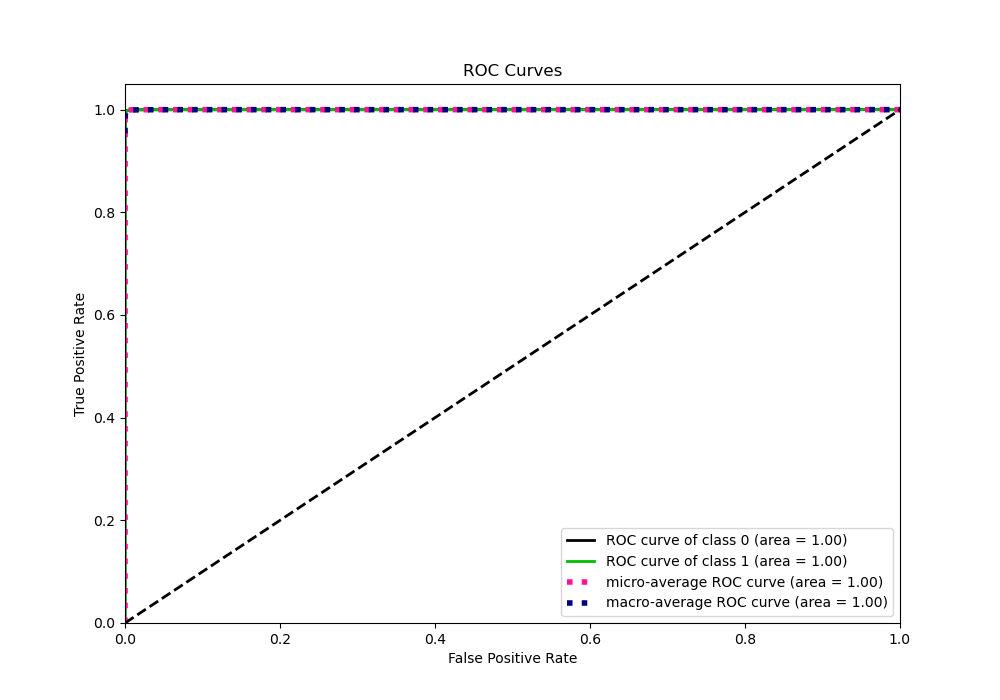
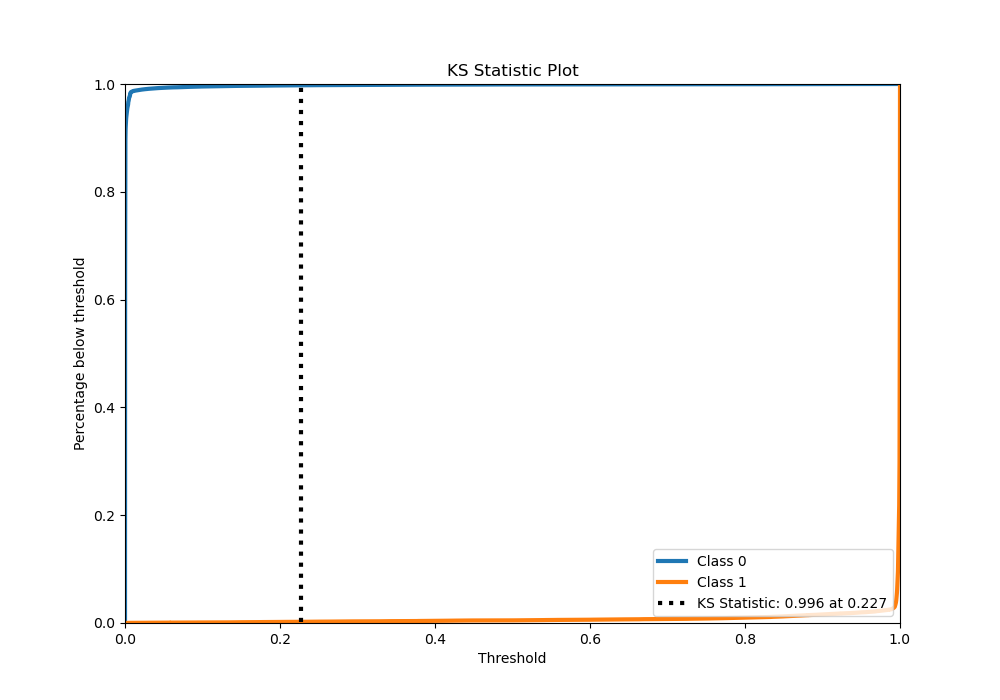
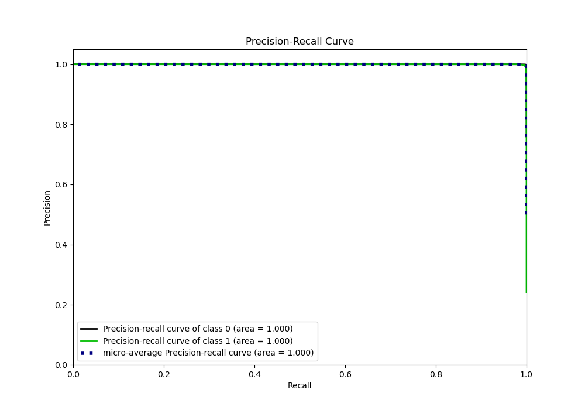
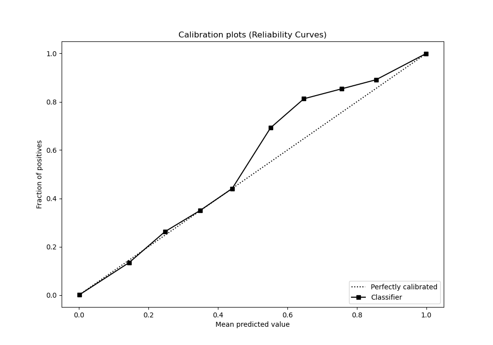
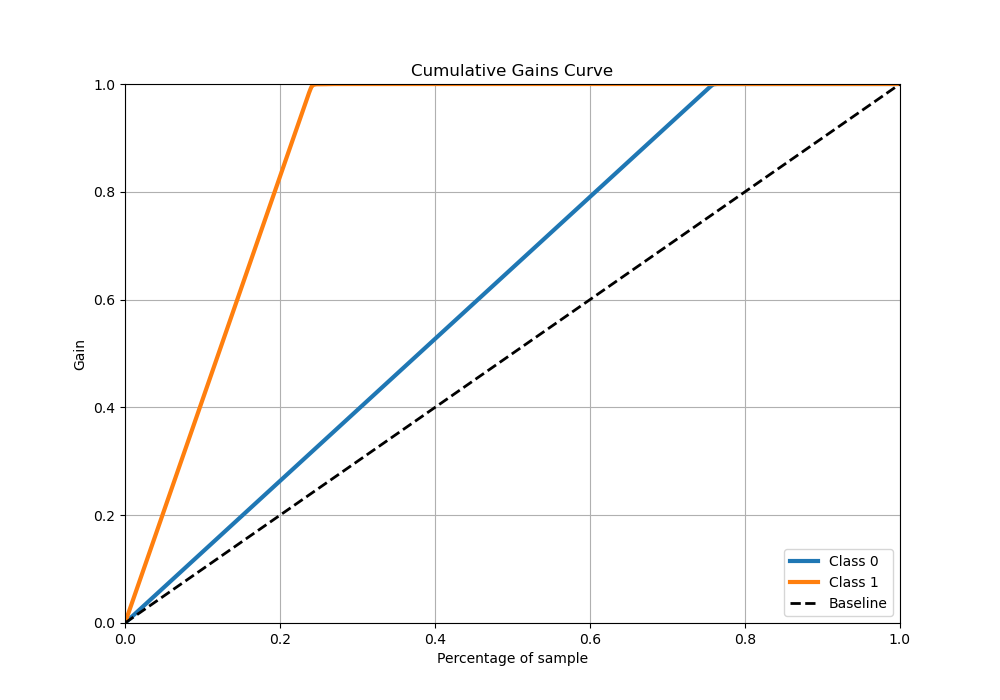
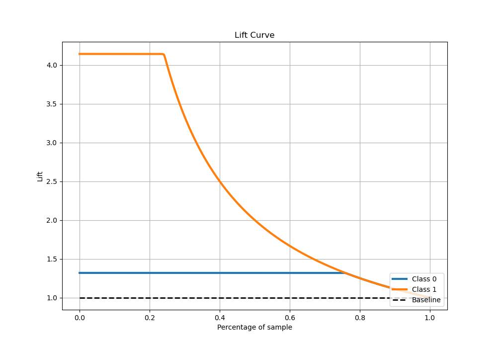

# Summary of 2_Xgboost

[<< Go back](../README.md)

## Extreme Gradient Boosting (Xgboost)
- **n_jobs**: -1
- **objective**: binary:logistic
- **eta**: 0.1
- **max_depth**: 7
- **min_child_weight**: 10
- **subsample**: 0.8
- **colsample_bytree**: 0.5
- **eval_metric**: f1
- **explain_level**: 1

## Validation
 - **validation_type**: kfold
 - **k_folds**: 5
 - **shuffle**: True

## Optimized metric
f1

## Training time

219.4 seconds

## Metric details
|           |      score |     threshold |
|:----------|-----------:|--------------:|
| logloss   | 0.00555549 | nan           |
| auc       | 0.999969   | nan           |
| f1        | 0.995842   |   0.610597    |
| accuracy  | 0.997998   |   0.610597    |
| precision | 1          |   0.995377    |
| recall    | 1          |   4.72931e-06 |
| mcc       | 0.994527   |   0.610597    |

## Metric details with threshold from accuracy metric
|           |      score |   threshold |
|:----------|-----------:|------------:|
| logloss   | 0.00555549 |  nan        |
| auc       | 0.999969   |  nan        |
| f1        | 0.995842   |    0.610597 |
| accuracy  | 0.997998   |    0.610597 |
| precision | 0.997934   |    0.610597 |
| recall    | 0.993759   |    0.610597 |
| mcc       | 0.994527   |    0.610597 |

## Confusion matrix (at threshold=0.610597)
|              |   Predicted as 0 |   Predicted as 1 |
|:-------------|-----------------:|-----------------:|
| Labeled as 0 |            93144 |               61 |
| Labeled as 1 |              185 |            29458 |

## Learning curves

## Permutation-based Importance

## Confusion Matrix

## Normalized Confusion Matrix

## ROC Curve

## Kolmogorov-Smirnov Statistic

## Precision-Recall Curve

## Calibration Curve

## Cumulative Gains Curve

## Lift Curve

[<< Go back](../README.md)
