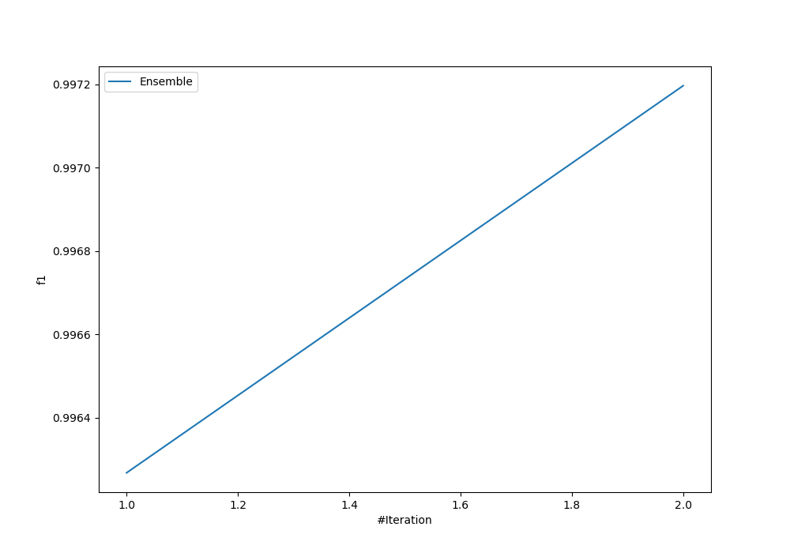
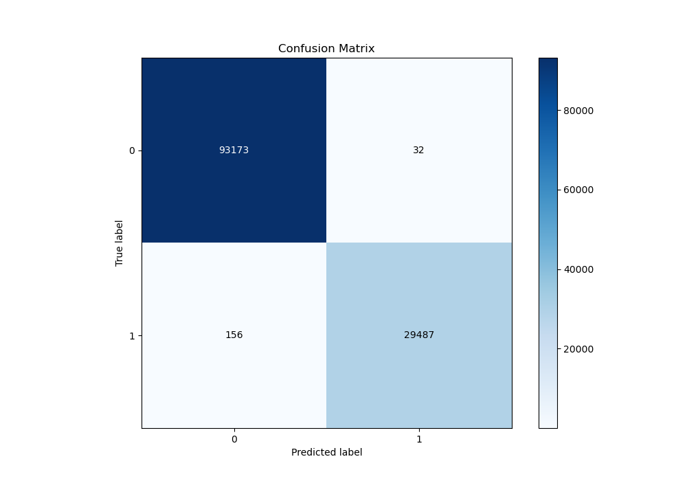
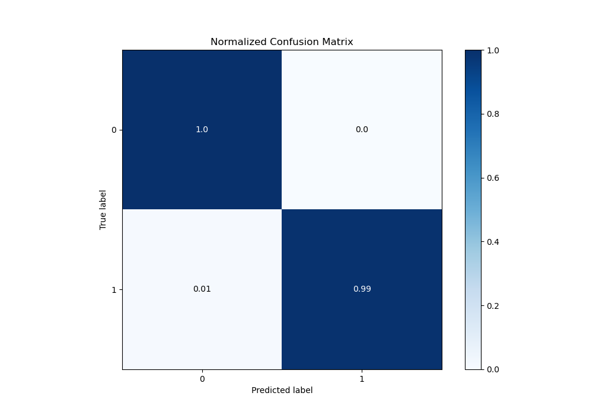
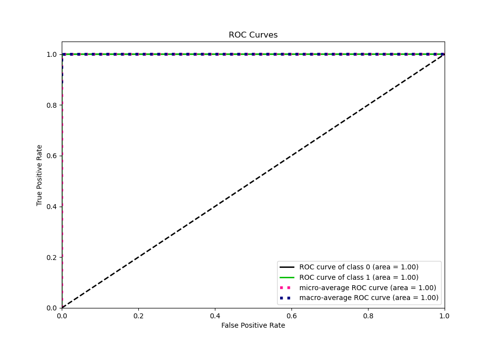
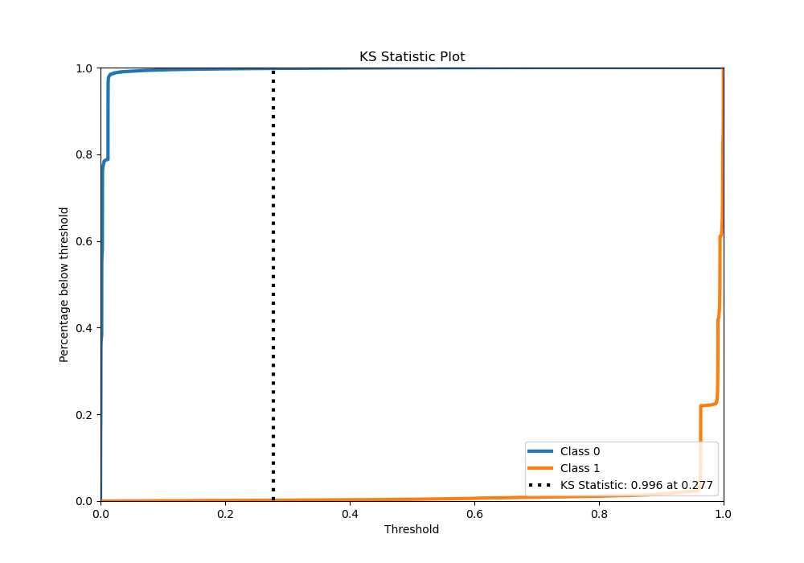
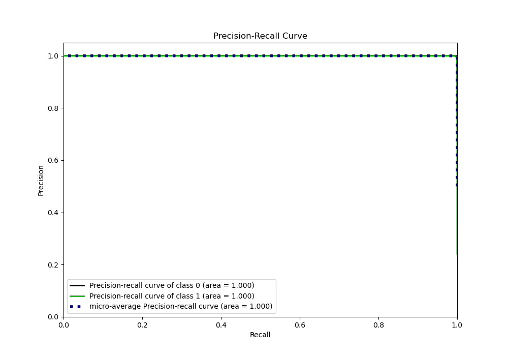
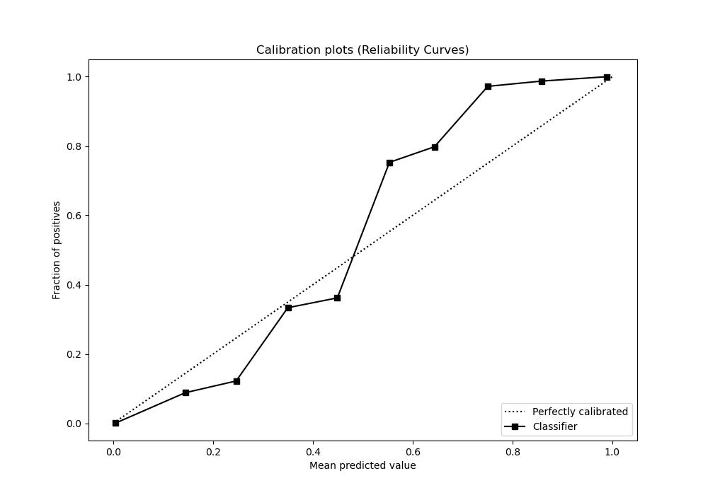
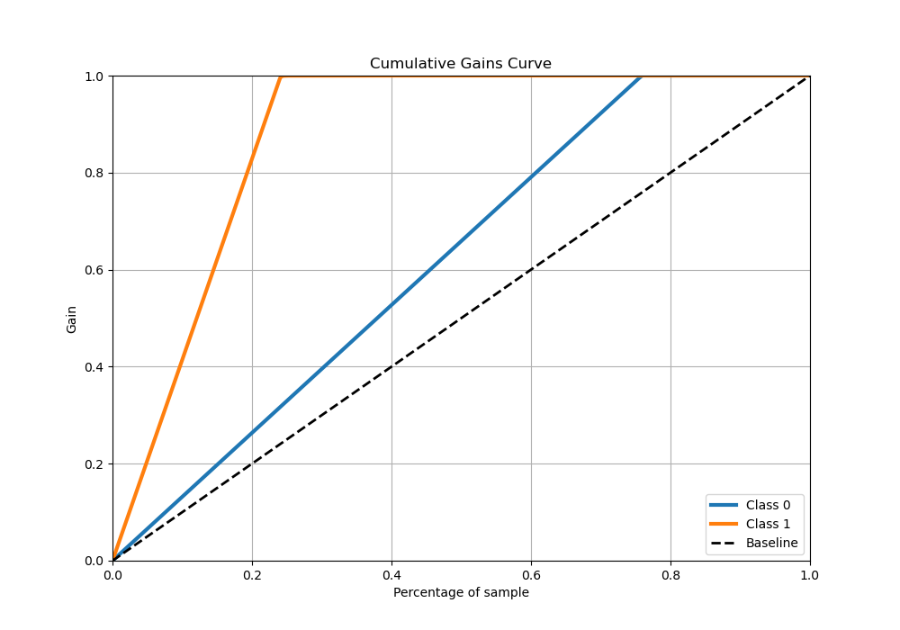
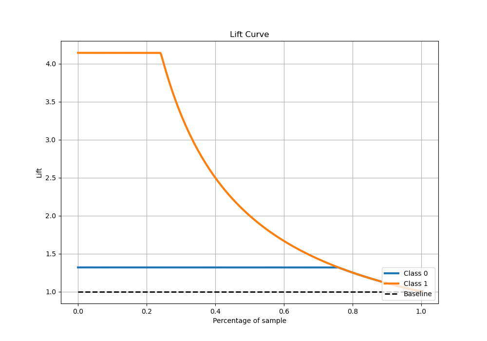

# Summary of Ensemble

[<< Go back](../README.md)

## Ensemble structure
| Model              |   Weight |
|:-------------------|---------:|
| 1_Default_LightGBM |        1 |
| 2_Xgboost          |        1 |

## Metric details
|           |      score |     threshold |
|:----------|-----------:|--------------:|
| logloss   | 0.00976699 | nan           |
| auc       | 0.999971   | nan           |
| f1        | 0.996822   |   0.558351    |
| accuracy  | 0.99847    |   0.558351    |
| precision | 1          |   0.962222    |
| recall    | 1          |   7.35681e-05 |
| mcc       | 0.995818   |   0.558351    |

## Metric details with threshold from accuracy metric
|           |      score |   threshold |
|:----------|-----------:|------------:|
| logloss   | 0.00976699 |  nan        |
| auc       | 0.999971   |  nan        |
| f1        | 0.996822   |    0.558351 |
| accuracy  | 0.99847    |    0.558351 |
| precision | 0.998916   |    0.558351 |
| recall    | 0.994737   |    0.558351 |
| mcc       | 0.995818   |    0.558351 |

## Confusion matrix (at threshold=0.558351)
|              |   Predicted as 0 |   Predicted as 1 |
|:-------------|-----------------:|-----------------:|
| Labeled as 0 |            93173 |               32 |
| Labeled as 1 |              156 |            29487 |

## Learning curves

## Confusion Matrix

## Normalized Confusion Matrix

## ROC Curve

## Kolmogorov-Smirnov Statistic

## Precision-Recall Curve

## Calibration Curve

## Cumulative Gains Curve

## Lift Curve

[<< Go back](../README.md)
